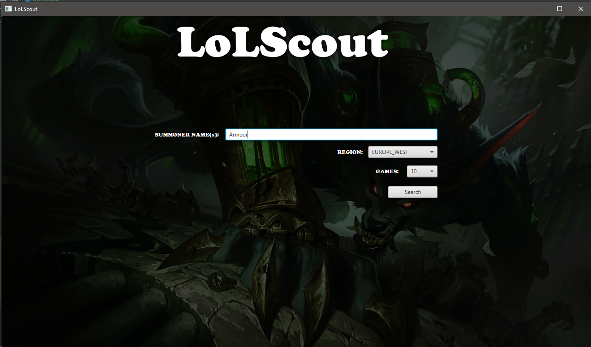
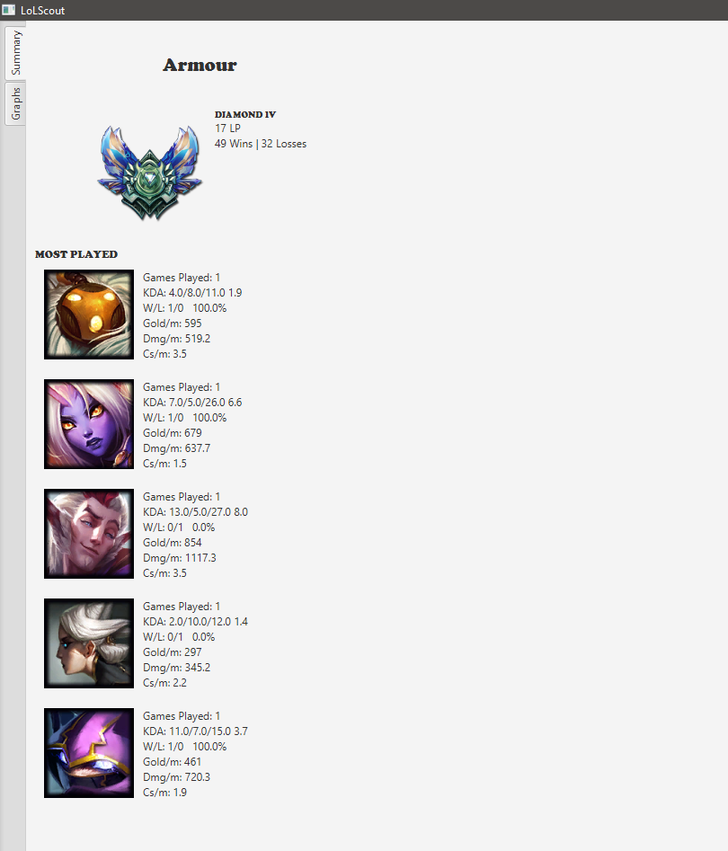
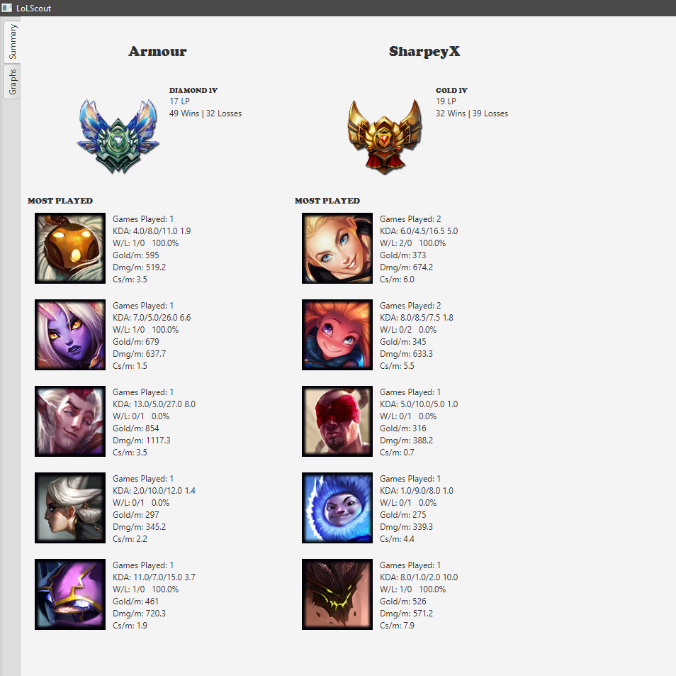
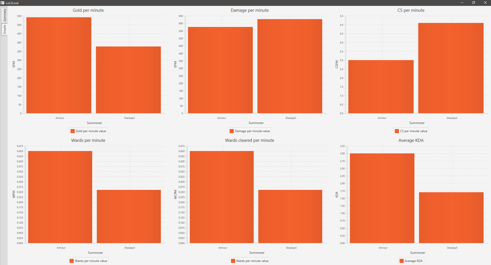

LoLScout

Uses Riot API to extract data from 1-5 players from any region at any one time, analysing up to the 100 most recent matches
of each player.

Requires an API key from https://developer.riotgames.com/ and the static data files from https://developer.riotgames.com/static-data.html
in the src/main/resources/LOL_STATIC/ directory to function.

Search Menu

Single Player Searching

Multiple Player Searching

Graph Comparison

Working as of patch 8.10, may not work currently.
